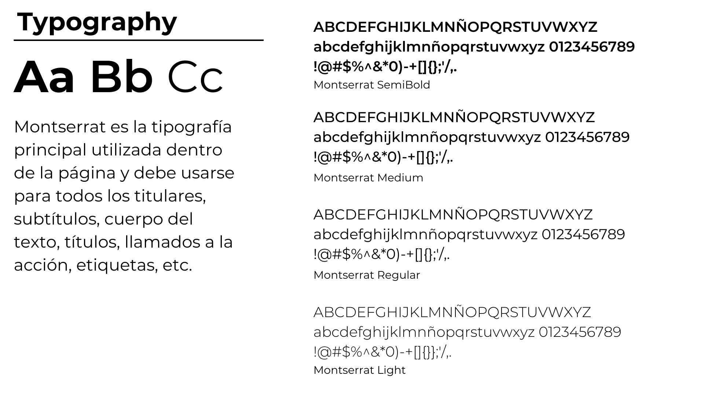
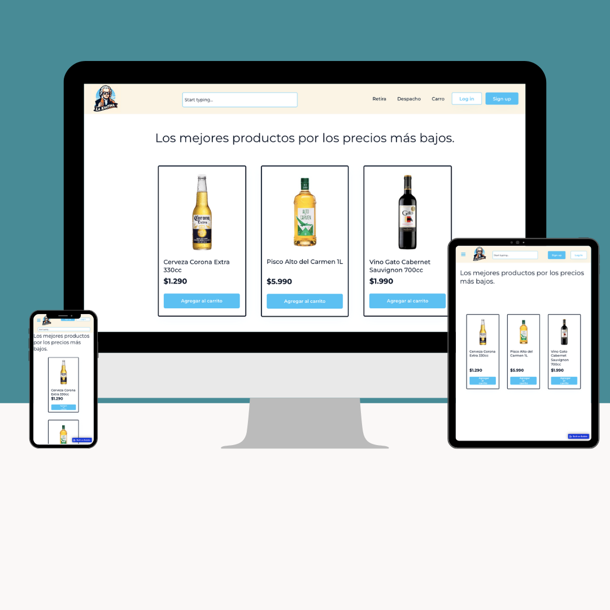
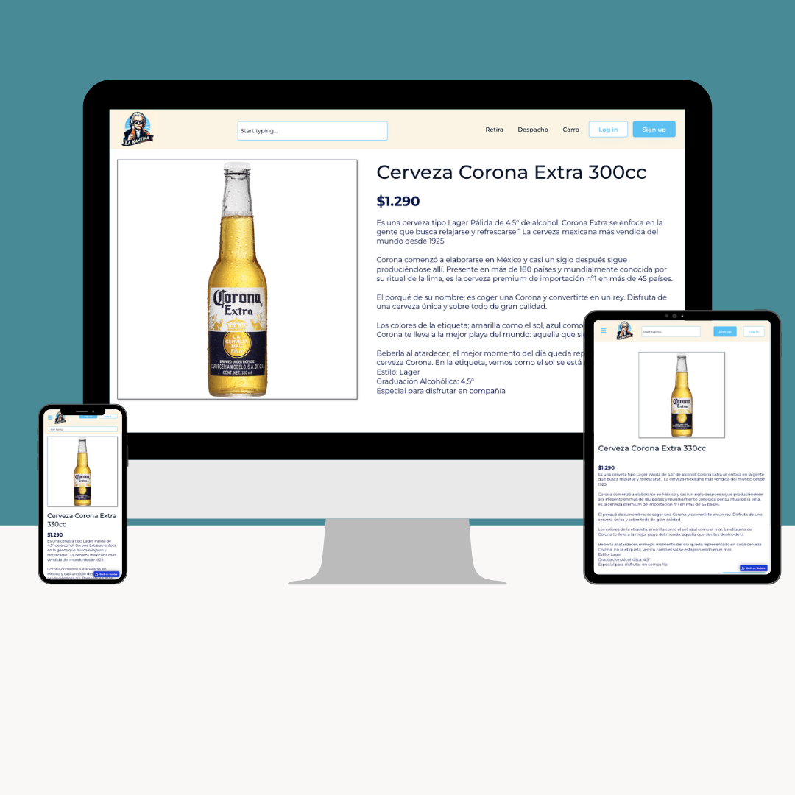
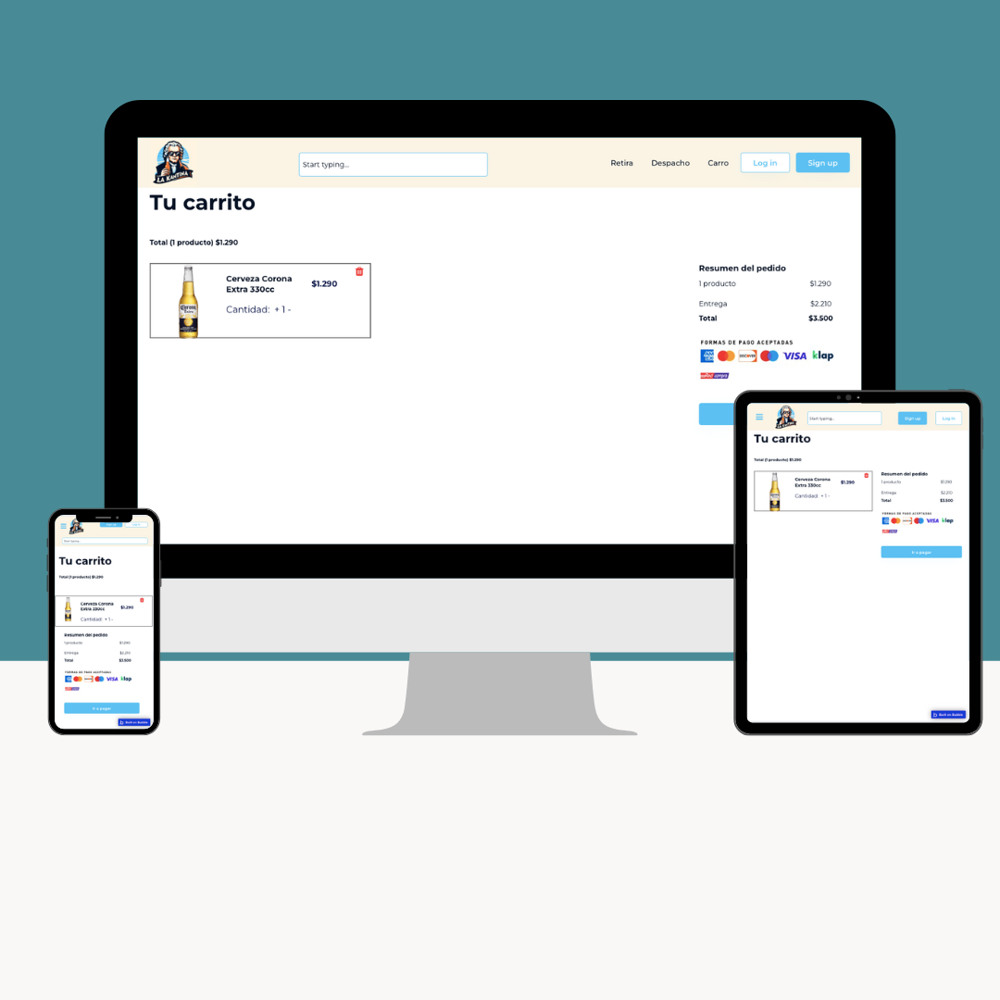

# E0 :construction:

* :pencil2: **Nombre Grupo:** Goodteam

## Descripción general :thought_balloon:

- ¿De qué se tratará el proyecto?
El proyecto consistirá en el desarrollo de una plataforma de comercio electrónico, especificamente de venta de licores y bebestibles, en donde se trabajarán los conceptos de técnologías web, como HTML CSS, JavaScript y React, para lograr desarrollar esta aplicación web funcional y atractiva.
- ¿Cuál es el fin o la utilidad del proyecto?
El fin de nuestro proyecto es desarrollar un e-commerce de licores que permita brindar a nuestros clientes una experiencia de navegación eficiente y segura, en donde sean capaces de buscar, seleccionar y comprar productos en línea con una interfaz que facilite estas acciones, simplificando el proceso de compra.
- ¿Quiénes son los usuarios objetivo de su aplicación?
Los usuarios objetivo de nuestra aplicación son toda persona mayor de 18 años, ya sea de genero femenino o masculino, que sea consumidora de licores o bebidas alcoholicas, y que este buscando una plataforma comoda, eficiente, con variedad y calidad de productos para su consumo.
## Historia de Usuarios :busts_in_silhouette:

1. Como [rol/usuario] quiero [requerimiento] para [objetivo]
2. ...
3. ...

## Diagrama Entidad-Relación :scroll:
<!-- Insertamos la imagen ER-Model.png -->

## Diseño Web :computer:

<!-- Documento de diseño web -->
### :art: Documento de diseño

<!-- Vistas principales -->
### :mag: Vistas principales

<!-- Logo -->
### :art: Logo

<!-- ejemplo de aplicacion -->
### :iphone: Ejemplo de aplicación

