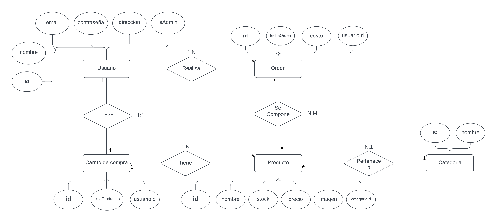
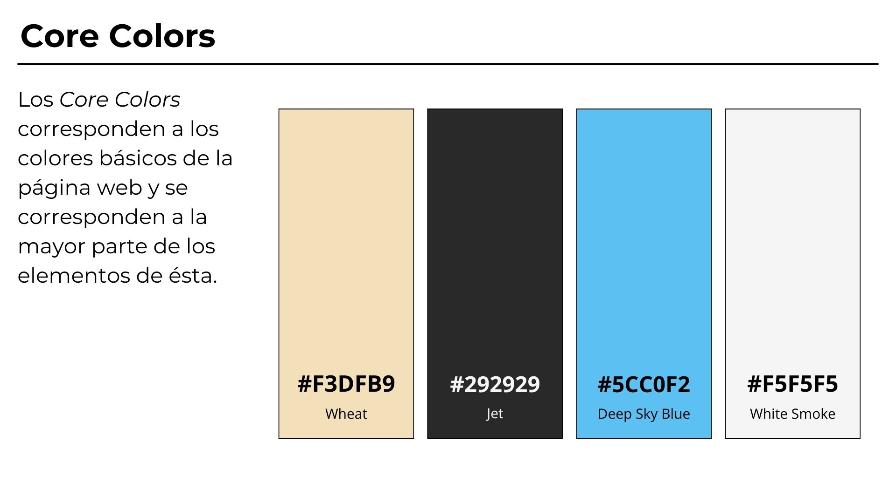
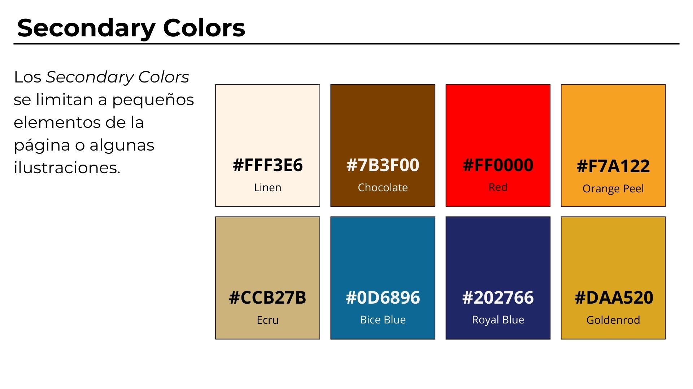
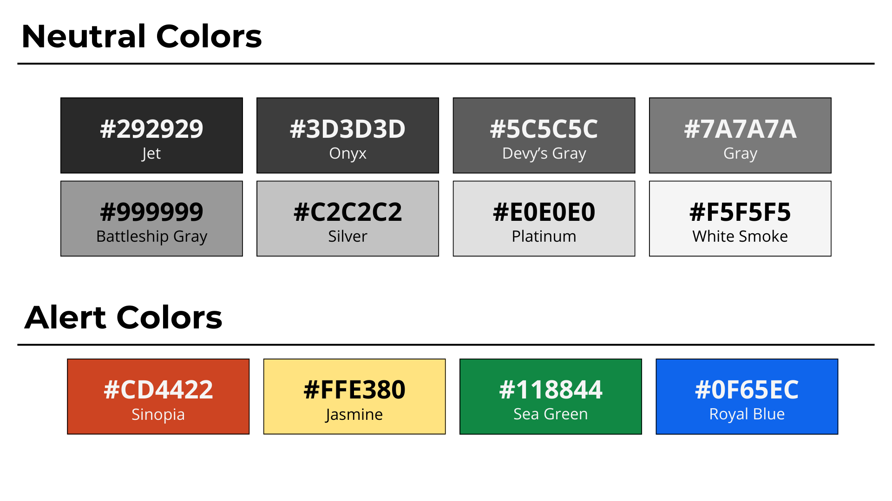
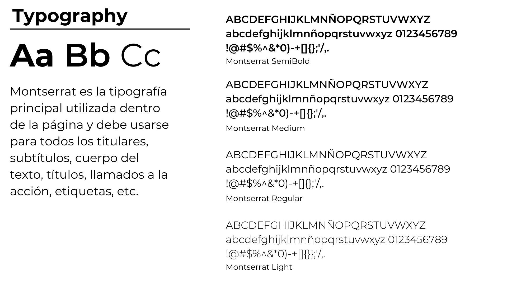
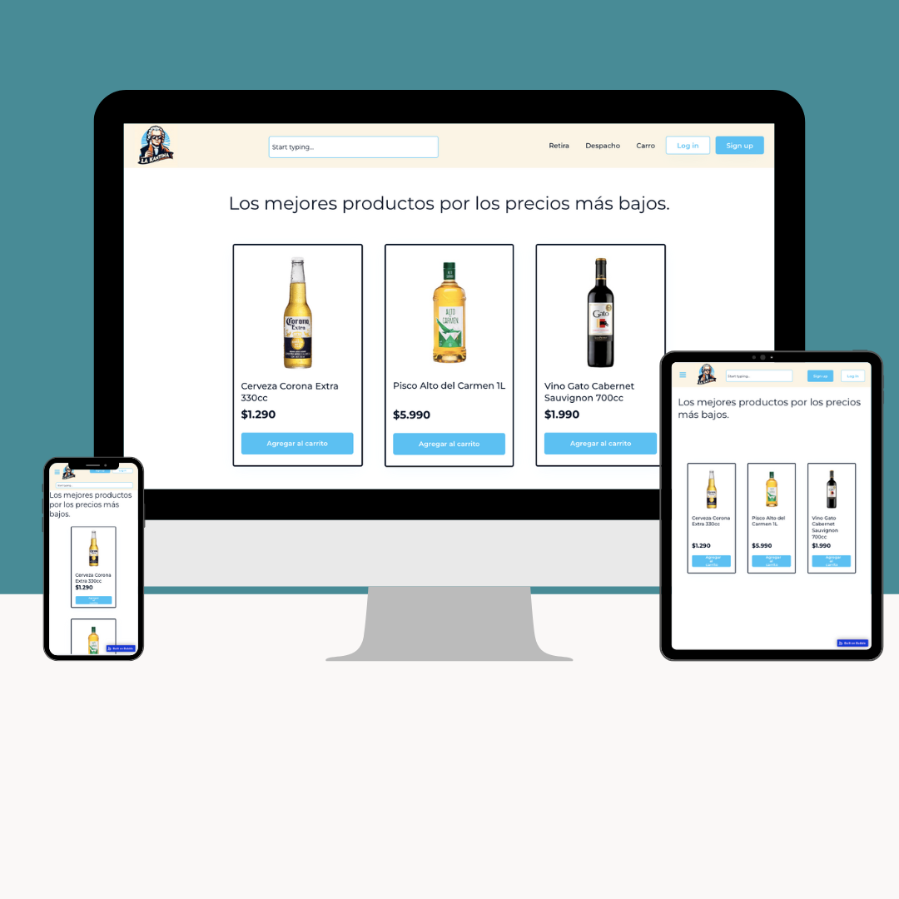
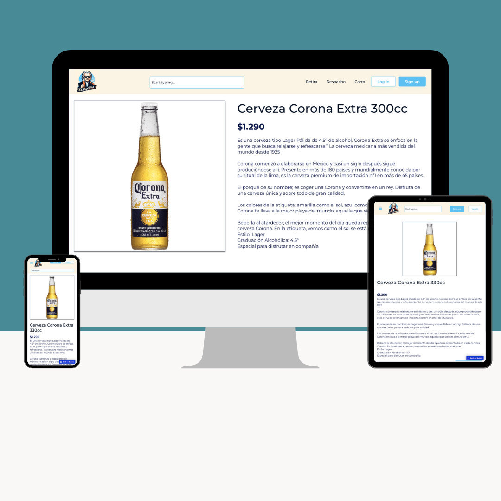
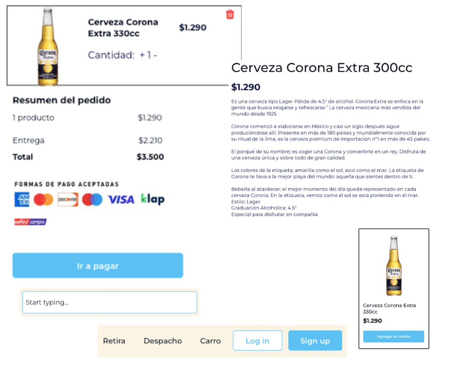

# E1 :construction:

* :pencil2: **Nombre Grupo:** Goodteam

#### Página de netlify:
```
https://mellow-queijadas-2264ae.netlify.app
```


## Descripción general :thought_balloon:

- ¿De qué se tratará el proyecto?
El proyecto consistirá en el desarrollo de una plataforma de comercio electrónico, especificamente de venta de licores y bebestibles, en donde se trabajarán los conceptos de técnologías web, como HTML CSS, JavaScript y React, para lograr desarrollar esta aplicación web funcional y atractiva.
- ¿Cuál es el fin o la utilidad del proyecto?
El fin de nuestro proyecto es desarrollar un e-commerce de licores que permita brindar a nuestros clientes una experiencia de navegación eficiente y segura, en donde sean capaces de buscar, seleccionar y comprar productos en línea con una interfaz que facilite estas acciones, simplificando el proceso de compra.
- ¿Quiénes son los usuarios objetivo de su aplicación?
Los usuarios objetivo de nuestra aplicación son toda persona mayor de 18 años, ya sea de género femenino o masculino, que sea consumidora de licores o bebidas alcohólicas, y que este buscando una plataforma cómoda, eficiente, con variedad y calidad de productos para su consumo.
## Historia de Usuarios :busts_in_silhouette:

#### 1. Visualización de producto

Como usuario con o sin cuenta registrada quiero ver los productos disponibles en la tienda, para encontrar lo que me interesa comprar.

#### 2. Filtrar productos

Como usuario con o sin cuenta registrada, quiero filtrar los resultados de búsqueda por precio y categoría, para poder comparar y elegir los mejores productos según mis intereses.

#### 3. Ver información de productos

Como usuario con o sin cuenta registrada, quiero ver una descripción detallada de cada producto, para tomar una decisión informada antes de comprar el producto.

#### 4. Registrar usuario

Como usuario, quiero registrarme en la plataforma y crear un perfil personal para gestionar mis compras y tener historial de pedidos.

#### 5. Iniciar sesión de usuario

Como cliente, quiero iniciar sesión en mi cuenta, para acceder a mis datos guardados, preferencias, historial de pedidos y envíos.

#### 6. Añadir productos al carrito

Como usuario registrado, quiero añadir productos a mi carrito de compras y seguir navegando sin perder mi selección, para así seguir explorando otras opciones antes de finalizar mi compra.

#### 7. Modificar carrito

Como usuario, quiero modificar los productos de mi carrito y eliminar artículos si es necesario, para así ajustar mi pedido antes de proceder al pago.


#### 8. Agregar direcciones de envío

Como cliente, quiero añadir y gestionar múltiples direcciones de envío, para poder enviar mis compras a diferentes ubicaciones según mis necesidades.

#### 9. Seguir estado de pedidos

Como cliente, quiero seguir el estado de mis pedidos a tiempo real, para saber una fecha aproximada de cuándo recibiré mis productos.

#### 10. Añadir productos nuevos

Como administrador, quiero añadir nuevos productos al catálogo, para mantener la tienda actualizada con los productos más recientes.

#### 11. Modificar productos de la página

Como administrador, quiero modificar la información de los productos existentes, para asegurar que toda la información esté correcta y actualizada.

#### 12. Eliminar productos de la página

Como administrador, quiero eliminar productos que ya no están disponibles o que han sido descontinuados, para mantener el catálogo actualizado.


## Diagrama Entidad-Relación :scroll:
<!-- Insertamos la imagen ER-Model.png -->


## Diseño Web :computer:

<!-- Documento de diseño web -->
### :art: Documento de diseño






<!-- Vistas principales -->
### :mag: Vistas principales




<!-- Logo -->
### :art: Logo


<!-- ejemplo de aplicacion -->
### :iphone: Ejemplo de aplicación

